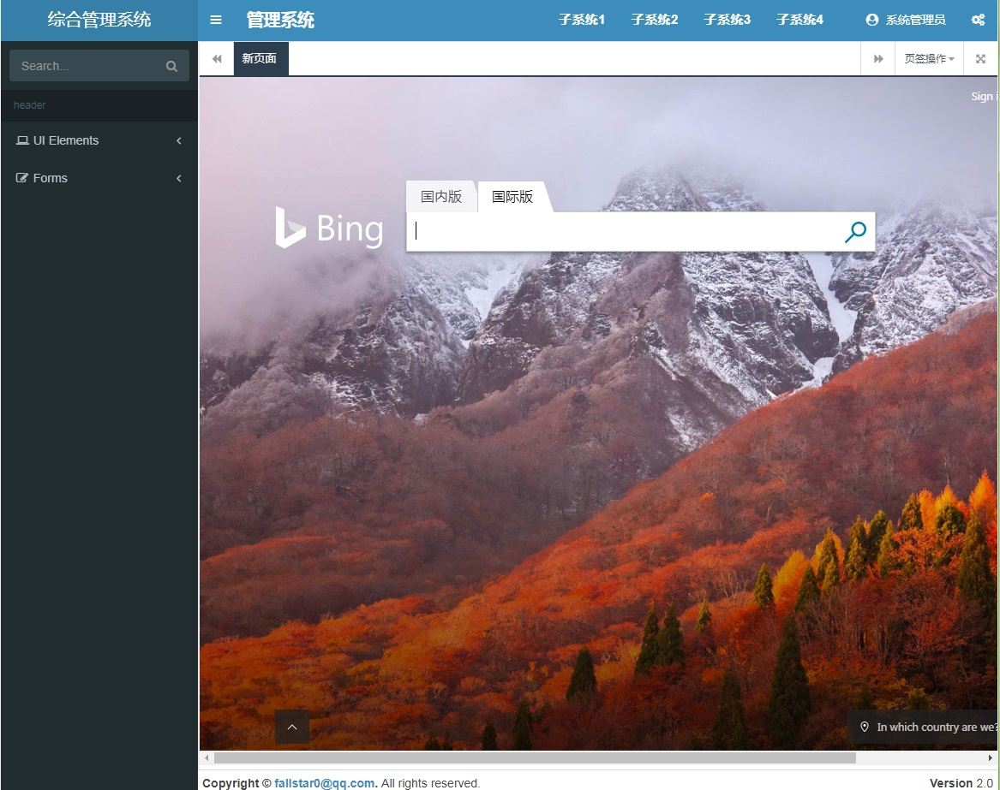
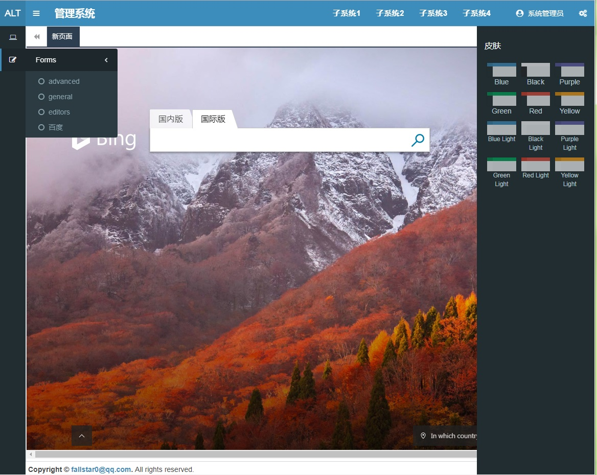

# AdminLTE-With-Iframe-Simple

Project Url   
 [https://gitee.com/fallstar/AdminLTE-With-Iframe-Simple](https://gitee.com/fallstar/AdminLTE-With-Iframe-Simple)   

[https://github.com/FallStar0/AdminLTE-With-Iframe-Simple](https://github.com/FallStar0/AdminLTE-With-Iframe-Simple)

[Chinese Version](README.zh-cn.md)

## Instruction

The full version of the project comes from this project :

[https://gitee.com/weituotian/AdminLTE-With-Iframe](https://gitee.com/weituotian/AdminLTE-With-Iframe "AdminLTE-With-Iframe")

This project has too many dependences ,so I had to make it simple to use.

Only base framework from AdminLTE and tab manange with iframes.

Change skin function is still avalible.

## Shot




## Supplement

About how to open new tab in child pages :

```
//include the follow js in child page
// this js contains tab methods : add / close / refresh
// you can extend it by your self
tab.util.js

call method:
//Open an external link
Util.addTab('https://google.com','google','Google',true});
//Open a relative link
Util.addTab('/test/404.html','404','404 Not Found'});
//Close current page
Util.closeTab();
```